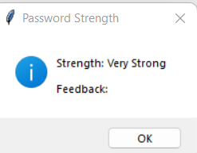
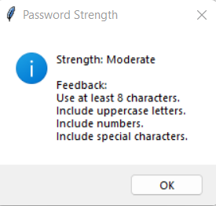
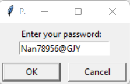
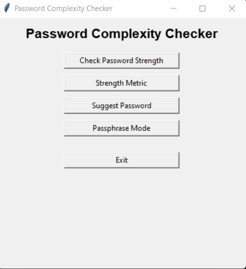

# Password Complexity Checker

A robust tool for assessing and enhancing password strength with features like real-time feedback, password strength metrics, and secure passphrase generation. Simplify password security with this intuitive tool.

## Features
- Real-time password strength feedback
- Password strength metrics
- Secure password suggestions
- Passphrase generation

## How It Works
1. Input your password to check its strength and receive improvement suggestions.
2. Generate strong passwords or passphrases using the built-in tools.
3. Get detailed metrics on password strength and adjust accordingly.

## Screenshots
### Real-time password strength feedback:

    
   
    
 

